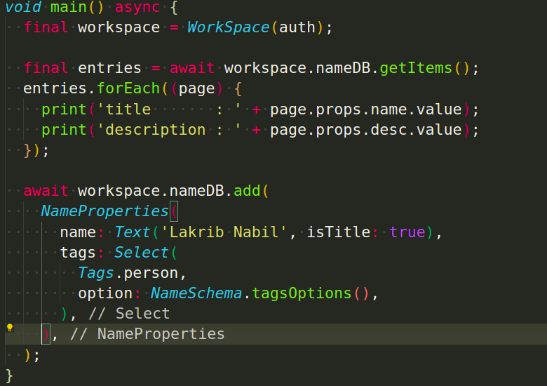

# Notion API - Dart



there are three main concepts

1. **Schema** defines the expected properties from Pages, and to [update them](https://www.notion.so/General-API-architecture-2d7150f130a441bfaed2ad8b3611fb2f)
2. **Page** gets / sets page properties
3. **Database** add / list database entries 

## Schema

defines the expected properties

- common Properties of both Database and Page: `id`, `created_time`, `last_edited_time`
- pages custom properties

the `Schema` is essentiel to work with databases and pages, and by default handles the [Common Properties](https://www.notion.so/General-API-architecture-2d7150f130a441bfaed2ad8b3611fb2f) 

```dart
class Schema {
  final String id;
  final DateTime created;
  final DateTime updated;

  Schema(Map<String, dynamic> data)
      : id = data['id'],
        created = DateTime.parse(data['created_time']),
        updated = DateTime.parse(data['last_edited_time']);
}
```

**Custom Properties**

to add custom Properties, create child class by extending the `Schema` class, and use the [supported Records](https://www.notion.so/General-API-architecture-2d7150f130a441bfaed2ad8b3611fb2f) to describe the Property types

```dart
enum Tags { person, device, DEFAULT }
enum Contexts { random, learning, programming, DEFAULT }

class NameSchema extends Schema{
  final Text name;
  final Text desc;
  final Number year;
  final Select<Tags> tags;
  final MultiSelect<Contexts> context;
  final CheckBox done;

  NameSchema(
    Map<String, dynamic> data, {
    required this.name,
    required this.desc,
    required this.year,
    required this.tags,
    required this.context,
    required this.done,
  }) : super(data);
}
```

### SchemaProperties

`SchemaProperties`  used by `Page.setProps` to update **certain** page properties 

the difference between `Schema` and `SchemaProperties`, is `SchemaProperties` treats all properties as optional, while `Schema` force them

```dart
class NameProperties extends SchemaProperties {
  final Text? name;
  final Text? desc;
  final Number? year;
  final Select<Tags>? tags;
  final MultiSelect<Contexts>? context;
  final CheckBox? done;
}
```

**Classes flow goes like that:**

1. `NameProperties` extends `SchemaProperties`
2. `NameSchema` extends `Schema`
3. `NameSchema` implements `NameProperties`

**Full Exemple:**

```dart
enum Tags { person, device, DEFAULT }
enum Contexts { random, learning, programming, DEFAULT }

class NameProperties extends SchemaProperties {
  final Text? name;
  final Text? desc;

  NameProperties({
    this.name,
    this.desc,
  });
}

class NameSchema extends Schema implements NameProperties {
  @override
  final Text name;
  @override
  final Text desc;
  NameSchema(
    Map<String, dynamic> data, {
    required this.name,
    required this.desc,
  }) : super(data);
}
```

---

**Supported Records:**

- `Select<T>`  Select Property, `<T>` must be an `enum` that has a `DEFAULT` option
- `MultiSelect<T>` Multiple Selection Property `<T>` must be an `enum`
- `Text` Text Property, set `isTitle` to true if you refer to the page title

    E.g. `Text('page title', isTitle:true)`

    E.g. `Text('Normal Text Property')`

- `Number`
- `CheckBox` represent a **boolean** property